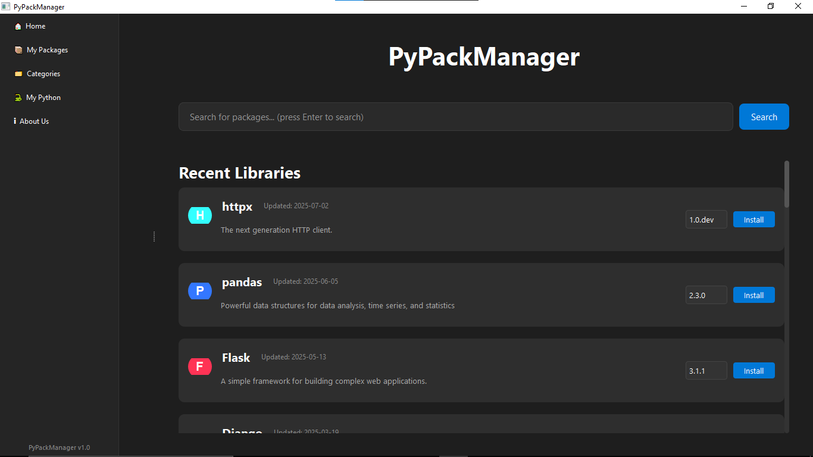
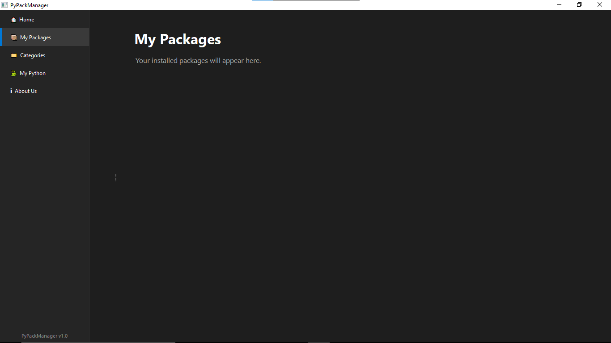
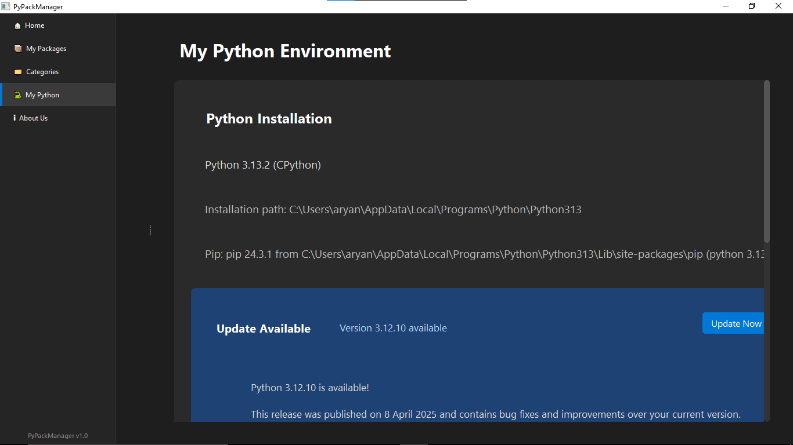
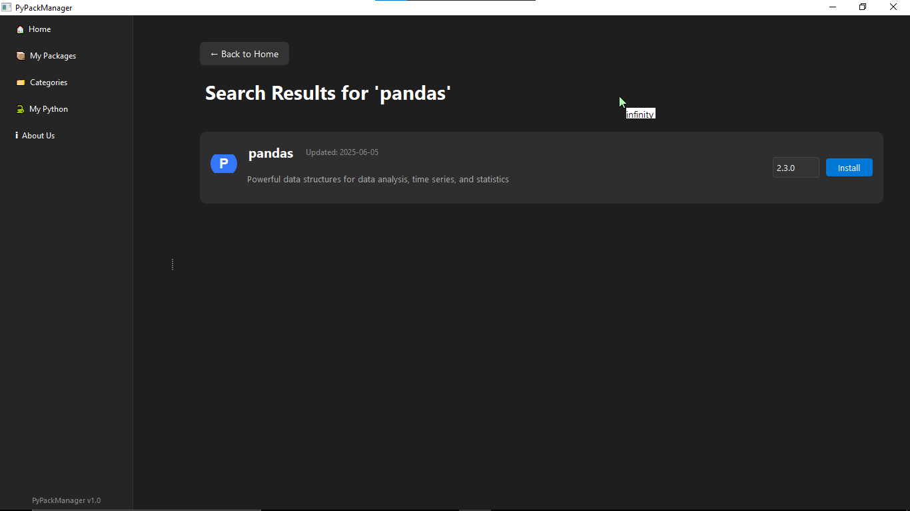
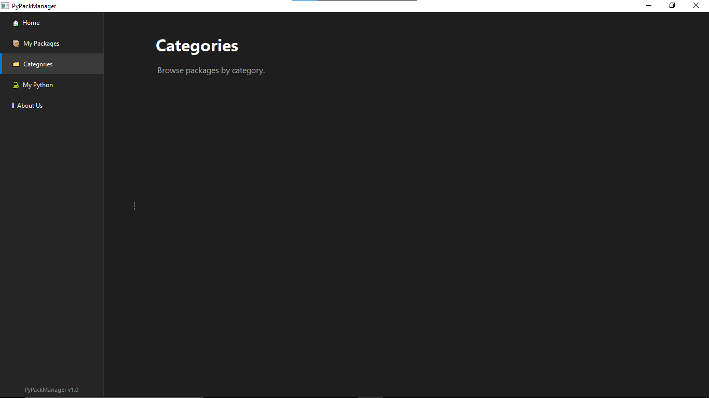
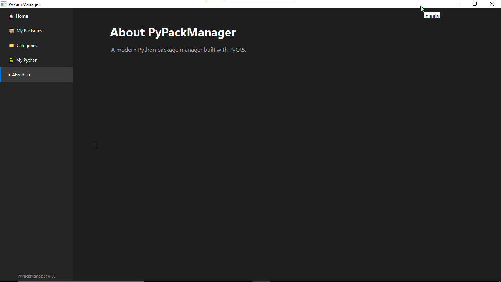

# 🐍 PyPackManager GUI

**PyPackManager GUI** is an **ongoing GUI project** that aims to provide a beautiful, beginner-friendly desktop interface for discovering, managing, and installing Python packages. Designed with simplicity and clarity in mind, this tool helps developers break free from the command-line and explore the Python ecosystem visually.

---

## 🚀 Features

- 🔎 **Search Functionality** – Quickly find Python packages by name  
- 🧱 **Package Cards** – Display each package as a clean, styled card  
- 📝 **Detailed View** – View detailed info like version history, links, and descriptions  
- 📂 **Sidebar Navigation** – Navigate with tabs like Home, My Packages, Categories, and About  
- 🧵 **Threaded Search** – Keeps the UI smooth during long operations  
- 📦 **Offline Mock Data** – Ready for real data integration in future releases  

> ⚠️ **Note**: This is a work in progress. Future updates will include real-time PyPI integration, theming support, and package installation/uninstallation features.

---

## 📁 Project Structure

```
PyPackManager GUI/
├── main.py                # Entry point
├── app_window.py          # Sets up main window and navigation
├── package_card.py        # Widget for package card UI
├── search_thread.py       # Handles threaded searching
├── icons/
│   └── python_default.png # Default icon for packages
├── ui/
│   ├── detail_page.py     # View for detailed package info
│   ├── home_page.py       # Home with recent and trending cards
│   ├── search_page.py     # Displays search results
│   └── placeholder_page.py# Shown when no data available
└── structure.txt          # Project outline (for dev reference)
```

---

## 📦 Requirements

- Python 3.10+
- GUI Framework:
  - [PyQt5](https://pypi.org/project/PyQt5/) **or**
  - [PySide2](https://pypi.org/project/PySide2/)

### 🔧 Install Dependencies

```bash
pip install PyQt5
```

---

## ▶️ Running the App

```bash
cd "PyPackManager GUI"
python main.py
```

---

## 🛠️ Development Goals

- 🔗 Integrate live data from the [PyPI JSON API](https://warehouse.pypa.io/api-reference/json.html)  
- 📊 Add filtering by category, version, and popularity  
- 🌙 Add light/dark theme toggle  
- 📥 Support install/uninstall of packages with progress indicators  
- 📚 Display more metadata like author, release date, etc.

---

## 📸 UI Preview

Here are some screenshots of the PyPackManager GUI in action:

### 🏠 Home Page


### 📦 My Packages


### 🧠 My Python Environment


### 🔍 Search Results


### 📁 Categories


### 🧾 About Us


---

## 📃 License

This project is licensed under the **MIT License**. You are free to use, modify, and distribute it for personal and commercial purposes.

---

## 🙌 Contributing

Pull requests and feedback are welcome! If you'd like to contribute:

1. Fork the repo
2. Create your feature branch (`git checkout -b feature/your-feature`)
3. Commit your changes (`git commit -m 'Add your message'`)
4. Push to the branch (`git push origin feature/your-feature`)
5. Create a new Pull Request

---

### 👨‍💻 Made with 💚 by Infinity Artist
